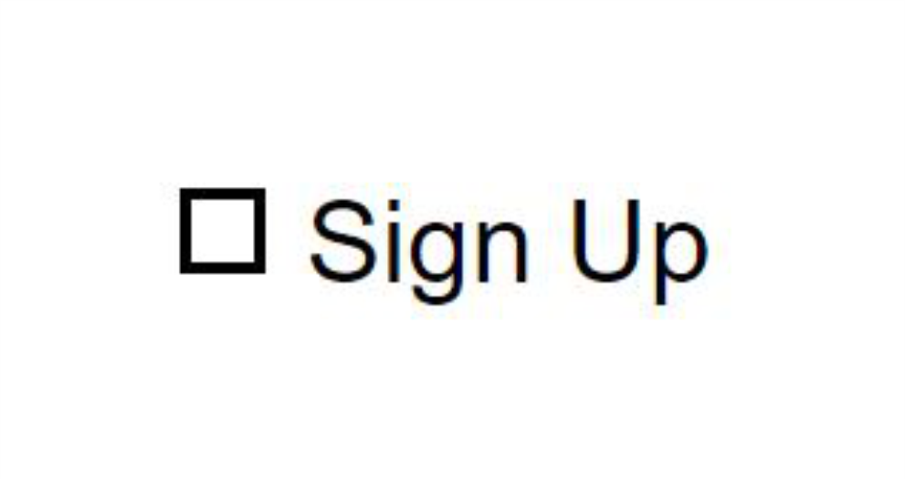
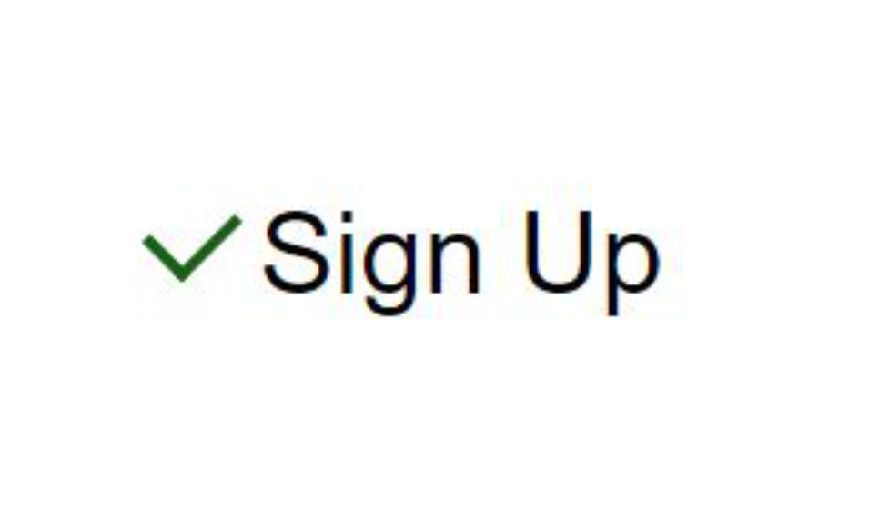

<h4 align="center">
     
</h4>

<h4 align="center"> 
	:heavy_check_mark: CheckBox Effect :heavy_check_mark:
</h4>

  
    
  
  
  

  
   

  <a href="#-project">Project</a>&nbsp;&nbsp;&nbsp;|&nbsp;&nbsp;&nbsp;
  <a href="#-tools">Tools</a>&nbsp;&nbsp;&nbsp;|&nbsp;&nbsp;&nbsp;
  <a href="#-layout">Layout</a>&nbsp;&nbsp;&nbsp;|&nbsp;&nbsp;&nbsp;
  <a href="#-how-to-use">How to use</a>&nbsp;&nbsp;&nbsp;|&nbsp;&nbsp;&nbsp;
  <a href="#-how-to-contribute">How to contribute</a>&nbsp;&nbsp;&nbsp;|&nbsp;&nbsp;&nbsp;
  <a href="#-license">License</a>

## 💻 Project

*The purpose of this project is to use CSS only to perform an animation of a CheckBox.*

**View Application:** <a href="https://jeanmendanhajr.github.io/css-CheckBoxEffect/src/" target="View Application">Checkbox Effect</a>

## 🔨 Tools

*This project was used only HTML5 and CSS3 codes for its animation.*

- [CSS](https://developer.mozilla.org/pt-BR/docs/Web/CSS) 
- [HTML](https://developer.mozilla.org/pt-BR/docs/Web/HTML)

    
## 🔖 Layout

* State 1
<h5>
     
</h5>

* State 2
<h5>
     
</h5>

## 🔩 How To Use

*You can test this code directly in your application. Just make a clone in the application. It can be tested through github pages.*

## 🤔 How to contribute

- Make a fork;
- Create a branck with your feature: `git checkout -b my-feature`;
- Commit changes: `git commit -m 'feat: My new feature'`;
- Make a push to your branch: `git push origin my-feature`.

After merging your receipt request to done, you can delete a branch from yours.

## 📝 License

This project is under the MIT license. See the [LICENSE](LICENSE.md) for details.

---

Made by <strong>Jean Mendanha ♠️ 
 

